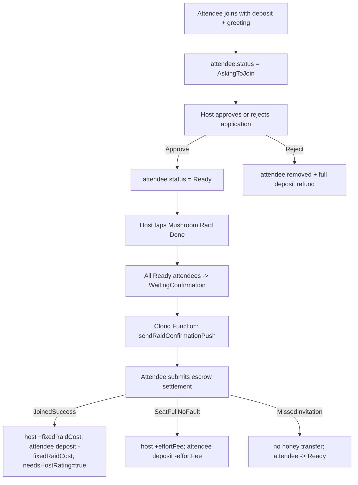

# Mushroom

## Related Files
- `mushroomHunter/Features/Mushroom/RoomBrowseView.swift`: mushroom room list UI and room entry points.
- `mushroomHunter/Features/Mushroom/RoomBrowseViewModel.swift`: browse state, filtering, and join flow orchestration.
- `mushroomHunter/Features/Mushroom/RoomFormView.swift`: host room create/edit UI and form validation.
- `mushroomHunter/Features/Mushroom/RoomView.swift`: room details UI, attendee actions, finish flow, invite share sheet.
- `mushroomHunter/Features/Mushroom/RoomView.swift`: includes room-specific invite sheet wrapper used by room view.
- `mushroomHunter/Features/Shared/InviteShareSheet.swift`: shared invite QR sheet component used by room and postcard screens.
- `mushroomHunter/Features/Mushroom/RoomViewModel.swift`: room details state, role/join gating logic, and action orchestration.
- `mushroomHunter/Features/Mushroom/RoomDomainModels.swift`: room/attendee data models and status enums.
- `mushroomHunter/Features/Shared/BrowseViewTopActionBar.swift`: shared honey/search/create header used by browse screens.
- `mushroomHunter/Features/Shared/SelectAllTextField.swift`: shared auto-select text field wrapper used by host/profile/profile-create forms.
- `mushroomHunter/Features/Shared/SelectAllTextEditor.swift`: shared auto-select text editor wrapper used by host description input.
- `mushroomHunter/Features/Shared/HoneyMessageBox.swift`: shared custom confirmation/error dialog used across mushroom room screens.
- `mushroomHunter/Services/Firebase/RoomBrowseRepo.swift`: Firestore reads for browsing open rooms.
- `mushroomHunter/Services/Firebase/RoomFormRepo.swift`: Firestore writes for host room lifecycle (create/update/close).
- `mushroomHunter/Services/Firebase/RoomRepo.swift`: Firestore reads for a single room and attendee list.
- `mushroomHunter/Services/Firebase/RoomActionsRepo.swift`: Firestore transactions for join/leave/deposit/raid confirmation/rating.
- `mushroomHunter/Utilities/RoomInviteLink.swift`: deep link generation/parsing for `honeyhub://room/{roomId}`.
- `mushroomHunter/Utilities/AppConfig.swift`: centralized owner-managed mushroom settings (attribute lists, fixed raid defaults, room limits, query limits).
- `mushroomHunter/Utilities/FriendCode.swift`: shared friend-code sanitizing/formatting/validation utility used across profile, room, and postcard flows.
- `functions/index.js`: server-side push triggers used by mushroom confirmation flows.

## Feature Coverage
- Main Mushroom tab icon uses SF Symbol `person.3.fill` to reflect group room coordination.
- Host can create and manage a room with title/location/description/fixed raid cost (no target mushroom selectors in create/edit UI).
- Browse search is opened from the top action bar as an inline search field above the room list (no dedicated sheet/alert).
- Mushroom browse search matches room title and location text (country/city).
- Mushroom browse search applies local filtering while typing; backend fetch (first page) is refreshed only when user taps `Search`.
- Inline search field includes an `x` clear button only; pressing keyboard Enter triggers search. Top-bar search icon toggles field show/hide.
- UI-test mode (`--ui-testing --mock-rooms`) routes host submit flow through mock success without Firestore writes.
- Host create/edit description is prefilled with localized default `host_default_description` (`Welcome! Let's play!`) when empty.
- Host can manage attendees (kick, close room, finish raid/claim cycle).
- Join request workflow:
  - Joiner enters deposit + greeting message.
  - Join request creates attendee with status `AskingToJoin` and occupies a room slot immediately.
  - Host can approve/reject from attendee row `...` menu.
  - Rejected application removes attendee and refunds full deposit.
- Host `Mushroom Raid Done` now sends escrow settlement requests to all non-host joiners in the room (instead of manually selecting attendees).
- Joining from room details now requires both:
  - deposit amount
  - attendee greeting message (required, max 100 chars)
- Join sheet pre-fills a localized default greeting and blocks submit when greeting is empty.
- Join confirmation alert now includes both `Sure` and `Cancel` actions.
- UI-test mode supports room deep-link routing via launch arg `--ui-open-room {roomId}` for deterministic room-entry automation.
- In UI-test mock mode, attendee leave can execute directly from the bottom action dock (and from edit-bid sheet) without confirmation alert to reduce automation flakiness.
- In UI-test mock mode, room role/deposit checks fall back to fixture user id (`ui-test-user`) when session auth uid is not yet populated.
- UI-test mock mode supports forcing fixture room attendee state at launch with `--mock-room-joined`.
- Host reject-resolution alert behavior:
  - `Resend`: sets attendee status back to `WaitingConfirmation` and triggers confirmation push again.
  - `Give Up`: sets attendee status back to `Ready`.
- Room confirmations and errors now use the shared `HoneyMessageBox` component instead of system `Alert`/`confirmationDialog`, so visual style and action layout are consistent across mushroom flows.
- Room details includes invite share tools for host:
  - QR code sheet.
  - Share/copy room invite link using deep link format `honeyhub://room/{roomId}`.
- Room details copy-feedback toast (`Copied to clipboard`) now uses the same visual style and timing as postcard screens to keep cross-feature behavior consistent.

## Cloud Functions (Mushroom Use Cases)
- `sendRaidConfirmationPush`
  - Trigger: update on `rooms/{roomId}/attendees/{attendeeUid}`
  - Sends only when attendee status transitions into `WaitingConfirmation`
  - Push target: `rooms/{roomId}/attendees/{attendeeUid}.fcmToken` first, with `users/{attendeeUid}.fcmToken` fallback
  - Payload data: `type=raid_confirmation`, `roomId`, `room_id`
- `notifyHostRaidConfirmationResult`
  - Trigger: update on `rooms/{roomId}/attendees/{attendeeUid}`
  - Sends only when status transitions from `WaitingConfirmation` to `Ready` or `Rejected`
  - Host resolved from cached `rooms/{roomId}.hostUid` first, with attendee query fallback where `status=Host`
  - Push target: `rooms/{roomId}.hostFcmToken` first, with `users/{hostUid}.fcmToken` fallback
  - Payload data:
    - joined success: `type=raid_confirmation_accepted`
    - seat full no-fault: `type=raid_confirmation_seat_full`
    - missed invitation: `type=raid_confirmation_missed_invite`

### Confirmation stars flow
- Attendee settlement flow now has three outcomes after host taps `Mushroom Raid Done`:
  - `Yes, joined success`: host gets full payment (`fixedRaidCost`), attendee deposit deducts full payment, attendee can rate host.
  - `No, seat full (no-fault race)`: host gets small effort fee (`AppConfig.Mushroom.noFaultEffortFee`), attendee deposit deducts only that effort fee.
  - `No, I didn't see invitation`: no honey transfer, treated as host-not-invited outcome.
- Star-selection buttons in rating message boxes use neutral bordered style (non-prominent) to reduce visual glare.
- Attendee rating is available only for `joined success` settlement.
- Host flow: when attendee accepts confirmation, attendee doc is marked `needsHostRating = true`; host can then give that attendee `1`, `2`, or `3` stars.
- Stars updates write to `users/{uid}.stars` and also refresh room attendee stars in the active room so Room Details reflects new totals immediately.
- Firestore transaction rule reminder: in room raid settlement transactions, read all attendee docs before applying any writes to avoid "all reads must occur before writes" transaction failures.

### Firestore data structure

#### `users/{uid}`
User profile and limits. Created/merged in `UserSessionStore.ensureUserProfile()` and by room actions when a user joins/leaves without a prior profile.
Fields:
- `displayName` (String): user’s in-app name. Updated when profile is saved or synced.
- `friendCode` (String): 12-digit friend code. Updated when profile is saved or synced.
- `stars` (Int): reputation/stars. Updated from profile settings.
- `honey` (Int): currency balance. Updated on join/leave/deposit changes and raid settlement.
- `maxHostRoom` (Int): limit of open rooms a user can host. Defaults to 1, synced on profile refresh.
- `maxJoinRoom` (Int): limit of open rooms a user can join. Defaults to 3, synced on profile refresh.
- `profileComplete` (Bool): computed from displayName + friendCode, synced on profile updates. profileComplete will be false at first, and after user field in displayName and friendCode and click on the create profile button. This variable will be set to true and never set back to false again.
- `fcmToken` (String, optional): device push token. Updated when token is received/refreshed. Each device/app install gets its own token and it can change over time.
- `createdAt` (Timestamp): set on first profile creation.
- `updatedAt` (Timestamp): last time the user data is updated. updated on any profile or balance change.

#### `rooms/{roomId}`
Mushroom rooms hosted by a player. We delete the room doc when the host closes it, so Firestore only stores active rooms.
Fields:
- `title` (String): room title. Set on create; updated on edit.
- `hostUid` (String): cached host uid used by backend push flows to avoid attendee host lookups.
- `hostFcmToken` (String, optional): cached host push token used by backend push flows before user lookup fallback.
- `location` (String): short location label. Set on create/update. Typically, consist of country, city
- `description` (String): description. Set on create/update.
- `fixedRaidCost` (Int): minimum honey deposit for joining. Set on create/update.
- `hostName` (String): host display name snapshot for quick browse rendering/search.
- `hostStars` (Int): host stars snapshot for quick browse rendering/search.
- `maxPlayers` (Int): max attendees (default 10). Set on create.
- `joinedCount` (Int): number of active attendees. Incremented on join, decremented on leave/kick/close. Host is counted as an attendee.
- `createdAt` (Timestamp): set on create.
- `updatedAt` (Timestamp): updated on any room or attendee change.
- `lastSuccessfulRaidAt` (Timestamp, optional): set when host finishes a raid.
- `expiresAt` (Timestamp, optional/future): not currently written by client; reserved.
Notes:
- Host identity and info are stored in `attendees/{uid}` with `status = Host` (the host is just an attendee).
- Legacy rooms may still include `targetColor`/`targetAttribute`/`targetSize`, but create/edit no longer writes or edits those fields.
- Host-room limit checks query `rooms.hostUid`.
- Join-room limit checks query attendee docs by `uid + active status` without per-room read fan-out.

#### `rooms/{roomId}/attendees/{uid}`
Attendee entries for a room. Written in join/leave/deposit flows.
Fields:
- `name` (String): attendee display name. Set on join.
- `uid` (String): attendee uid snapshot used by collection-group membership checks.
- `friendCode` (String): attendee friend code. Set on join.
- `fcmToken` (String, optional): attendee push token snapshot used by backend push flows before user lookup fallback.
- `stars` (Int): attendee stars. Set on join.
- `depositHoney` (Int): current deposit. Set on join; updated on deposit change and raid settlement.
- `joinGreetingMessage` (String): attendee greeting captured when joining. Required by join flow.
- `joinedAt` (Timestamp): set on join.
- `updatedAt` (Timestamp): updated on deposit changes and raid settlement.
- `status` (String): attendee state. Current values are `Host`, `AskingToJoin`, `Ready`, `WaitingConfirmation`, `Rejected`.
- `lastSettlementOutcome` (String, optional): latest escrow settlement result (`JoinedSuccess`, `SeatFullNoFault`, `MissedInvitation`).
- `lastSettlementHoney` (Int, optional): latest settled honey amount moved from attendee escrow to host for that settlement.
- `attendeeRatedHost` (Bool, optional): whether attendee already rated host for the latest confirmation cycle. Reset to `false` when host sends a new confirmation request.
- `hostRatedAttendee` (Bool, optional): whether host already rated attendee for the latest confirmation cycle. Reset to `false` when host sends a new confirmation request.
- `needsHostRating` (Bool, optional): set to `true` when attendee accepts confirmation (host receives honey) so host can rate attendee; set back to `false` after host submits stars.

# HoneyHub Raid Confirmation Flow Guide

This document explains the current confirmation flow between host and attendees in HoneyHub.

## Scope
This guide focuses on:
- Room join/deposit lifecycle
- Host raid confirmation request flow
- Attendee accept/reject flow
- Push notification triggers and routing
- Reputation (stars) flow after confirmation

## Source Of Truth
Main implementation files:
- `/Users/ken/Desktop/mushroomHunter/mushroomHunter/Services/Firebase/RoomActionsRepo.swift`
- `/Users/ken/Desktop/mushroomHunter/mushroomHunter/Features/Mushroom/RoomViewModel.swift`
- `/Users/ken/Desktop/mushroomHunter/mushroomHunter/Features/Mushroom/RoomView.swift`
- `/Users/ken/Desktop/mushroomHunter/functions/index.js`
- `/Users/ken/Desktop/mushroomHunter/mushroomHunter/User/UserSessionStore.swift`
- `/Users/ken/Desktop/mushroomHunter/mushroomHunter/User/UserAuth.swift`
- `/Users/ken/Desktop/mushroomHunter/mushroomHunter/User/UserProfile.swift`
- `/Users/ken/Desktop/mushroomHunter/mushroomHunter/User/UserWallet.swift`
- `/Users/ken/Desktop/mushroomHunter/mushroomHunter/App/HoneyHubApp.swift`
- `/Users/ken/Desktop/mushroomHunter/mushroomHunter/App/ContentView.swift`

## State Model
Attendee status values (`rooms/{roomId}/attendees/{uid}.status`):
- `Host`: room owner row in attendees subcollection
- `AskingToJoin`: join application pending host moderation
- `Ready`: normal active state (joined, not waiting)
- `WaitingConfirmation`: host has claimed this attendee joined raid, waiting attendee decision
- `Rejected`: attendee rejected host claim

Rating flags on attendee document:
- `attendeeRatedHost` (Bool): attendee already rated host in current confirmation cycle
- `hostRatedAttendee` (Bool): host already rated attendee in current confirmation cycle
- `needsHostRating` (Bool): set `true` only after attendee accepts confirmation

## End-To-End Flowchart

## Detailed Lifecycle
### 1. Join Room And Deposit Lock
When attendee joins:
- Check max joined-room limit (`users.maxJoinRoom`)
- Check room capacity (`joinedCount < maxPlayers`)
- Require `initialDepositHoney >= fixedRaidCost`
- Deduct deposit from `users/{uid}.honey`
- Create attendee row with:
  - `status = AskingToJoin`
  - `depositHoney = initialDepositHoney`
  - `joinGreetingMessage = joiner input`
- Increment `rooms.joinedCount`

Host moderation:
- Host can approve application from attendee `...` menu:
  - `status = Ready`
- Host can reject application from attendee `...` menu:
  - attendee row removed
  - `rooms.joinedCount - 1`
  - full deposit refunded to joiner wallet

Important behavior:
- Deposit is locked while attendee remains in room
- Leaving or being kicked refunds remaining deposit

### 2. Host Starts Confirmation Cycle
Host opens Room Details and uses `Mushroom Raid Done`:
- Client auto-targets all `Ready` non-host attendees in room
- `finishRaid(...)` updates each targeted attendee if `depositHoney >= fixedRaidCost`:
  - `status = WaitingConfirmation`
  - `attendeeRatedHost = false`
  - `hostRatedAttendee = false`
  - `needsHostRating = false`
- Room updates:
  - `lastSuccessfulRaidAt = now`
  - `updatedAt = now`

### 3. Push To Attendee (Request)
Cloud Function `sendRaidConfirmationPush` triggers on attendee doc update:
- Sends push only when status transitions into `WaitingConfirmation`
- Target token: `rooms/{roomId}/attendees/{attendeeUid}.fcmToken` (fallback `users/{attendeeUid}.fcmToken`)
- Payload data includes: `type=raid_confirmation`, `roomId`, `room_id`

### 4. Attendee Escrow Settlement
Room screen shows escrow settlement alert when current attendee is `WaitingConfirmation`.

If attendee chooses `JoinedSuccess`:
- Transaction moves honey:
  - Host user honey `+ fixedRaidCost`
  - Attendee `depositHoney - fixedRaidCost`
- Attendee status set:
  - `status = Ready`
  - `needsHostRating = true`

If attendee chooses `SeatFullNoFault`:
- Transaction moves small effort fee:
  - Host user honey `+ noFaultEffortFee`
  - Attendee `depositHoney - noFaultEffortFee`
- Attendee status set:
  - `status = Ready`
  - `needsHostRating = false`

If attendee chooses `MissedInvitation`:
- No honey transfer
- Attendee status set:
  - `status = Ready`
  - `needsHostRating = false`

### 5. Push To Host (Result)
Cloud Function `notifyHostRaidConfirmationResult` triggers when status transitions:
- `WaitingConfirmation -> Ready` with `JoinedSuccess`: send full-payment accepted message.
- `WaitingConfirmation -> Ready` with `SeatFullNoFault`: send no-fault seat-full effort-fee message.
- `WaitingConfirmation -> Ready` with `MissedInvitation`: send missed-invitation (no honey moved) message.
- Host is resolved by attendee row where `status = Host`
- Host token from `rooms/{roomId}.hostFcmToken` (fallback `users/{hostUid}.fcmToken`)

### 6. Resolve Rejected Case
Host sees rejected state in attendee row and can tap `Resolve`:
- `resolveRejectedConfirmation(...)` sets:
  - `status = Ready`
  - `needsHostRating = false`
- This does not transfer honey

### 7. Reputation (Stars) Flow
Attendee rates host:
- Allowed only when attendee status is `Ready`
- Blocked if `attendeeRatedHost == true`
- On success:
  - `users/{hostUid}.stars += 1..3`
  - Host attendee row stars updated in-room
  - `attendeeRatedHost = true`

Host rates attendee:
- Allowed only if caller is host and attendee:
  - `status == Ready`
  - `needsHostRating == true`
  - `hostRatedAttendee == false`
- On success:
  - `users/{attendeeUid}.stars += 1..3`
  - attendee row `stars` updated in-room
  - `hostRatedAttendee = true`
  - `needsHostRating = false`

## Push Routing In App
Push/deeplink routing path:
1. iOS receives push (`roomId` or `room_id` in payload)
2. App posts `Notification.Name.didOpenRoomFromPush`
3. `ContentView` opens a `NavigationStack` sheet containing `RoomView` for that room (so room toolbar actions are available for host/attendee roles)
4. `RoomViewModel.load()` fetches attendee statuses and recomputes pending states

## Data Mutation Map (Quick Reference)
- `joinRoom(...)`
  - attendee: create `AskingToJoin` + deposit + greeting
  - user: minus deposit honey
  - room: `joinedCount +1`
- `finishRaid(...)`
  - all ready non-host attendees: `WaitingConfirmation` + reset rating flags
  - room: `lastSuccessfulRaidAt`
- `respondToRaidConfirmation(JoinedSuccess)`
  - host user: plus raid cost honey
  - attendee row: minus deposit, `Ready`, `needsHostRating=true`
- `respondToRaidConfirmation(SeatFullNoFault)`
  - host user: plus no-fault effort fee honey
  - attendee row: minus effort fee, `Ready`, `needsHostRating=false`
- `respondToRaidConfirmation(MissedInvitation)`
  - no honey movement
  - attendee row: `Ready`, `needsHostRating=false`
- `resolveRejectedConfirmation(...)`
  - attendee row: `Ready`
- `rateHostAfterConfirmation(...)`
  - host user stars increment
  - host attendee row stars refresh
  - attendee row `attendeeRatedHost=true`
- `rateAttendeeAfterConfirmation(...)`
  - attendee user stars increment
  - attendee row stars refresh
  - attendee row `hostRatedAttendee=true`, `needsHostRating=false`

## Why This Feels Complex
Current complexity comes from a mixed set of responsibilities in one room flow:
- Financial escrow (`depositHoney`, `users.honey`)
- Attendance lifecycle (`AskingToJoin/Ready/WaitingConfirmation/Rejected`)
- Asynchronous signaling (push in both directions)
- Two-sided reputation flow with separate one-time flags

This is logically correct, but requires many state flags to avoid duplicate transfers/ratings.

## Suggested Mental Model For Team Members
Use these two layers when debugging:
1. Payment/confirmation layer:
- `status` + `depositHoney` + host `users.honey`
2. Reputation layer:
- `attendeeRatedHost` + `hostRatedAttendee` + `needsHostRating`

If a bug appears, first identify which layer is failing, then inspect only that layer's flags and writes.
