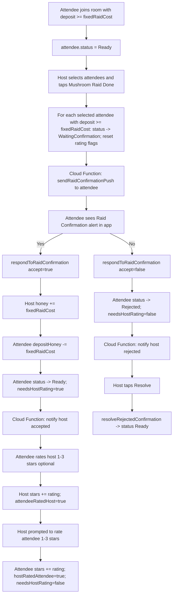

# HoneyHub Raid Confirmation Flow Guide

This document explains the current confirmation flow between host and attendees in HoneyHub.

## Scope
This guide focuses on:
- Room join/deposit lifecycle
- Host raid confirmation request flow
- Attendee accept/reject flow
- Push notification triggers and routing
- Reputation (stars) flow after confirmation

## Source Of Truth
Main implementation files:
- `/Users/ken/Desktop/mushroomHunter/mushroomHunter/Services/Firebase/FirebaseRoomActionsRepository.swift`
- `/Users/ken/Desktop/mushroomHunter/mushroomHunter/Features/RoomDetails/RoomDetailsViewModel.swift`
- `/Users/ken/Desktop/mushroomHunter/mushroomHunter/Features/RoomDetails/RoomDetailsView.swift`
- `/Users/ken/Desktop/mushroomHunter/functions/index.js`
- `/Users/ken/Desktop/mushroomHunter/mushroomHunter/Session/SessionStore.swift`
- `/Users/ken/Desktop/mushroomHunter/mushroomHunter/App/mushroomHunterApp.swift`
- `/Users/ken/Desktop/mushroomHunter/mushroomHunter/App/ContentView.swift`

## State Model
Attendee status values (`rooms/{roomId}/attendees/{uid}.status`):
- `Host`: room owner row in attendees subcollection
- `Ready`: normal active state (joined, not waiting)
- `WaitingConfirmation`: host has claimed this attendee joined raid, waiting attendee decision
- `Rejected`: attendee rejected host claim

Rating flags on attendee document:
- `attendeeRatedHost` (Bool): attendee already rated host in current confirmation cycle
- `hostRatedAttendee` (Bool): host already rated attendee in current confirmation cycle
- `needsHostRating` (Bool): set `true` only after attendee accepts confirmation

## End-To-End Flowchart

## Detailed Lifecycle
### 1. Join Room And Deposit Lock
When attendee joins:
- Check max joined-room limit (`users.maxJoinRoom`)
- Check room capacity (`joinedCount < maxPlayers`)
- Require `initialDepositHoney >= fixedRaidCost`
- Deduct deposit from `users/{uid}.honey`
- Create attendee row with:
  - `status = Ready`
  - `depositHoney = initialDepositHoney`
- Increment `rooms.joinedCount`

Important behavior:
- Deposit is locked while attendee remains in room
- Leaving or being kicked refunds remaining deposit

### 2. Host Starts Confirmation Cycle
Host opens Room Details and uses `Mushroom Raid Done`:
- Host selects attendee IDs
- `finishRaid(...)` updates each selected attendee if `depositHoney >= fixedRaidCost`:
  - `status = WaitingConfirmation`
  - `attendeeRatedHost = false`
  - `hostRatedAttendee = false`
  - `needsHostRating = false`
- Room updates:
  - `lastSuccessfulRaidAt = now`
  - `updatedAt = now`

### 3. Push To Attendee (Request)
Cloud Function `sendRaidConfirmationPush` triggers on attendee doc update:
- Sends push only when status transitions into `WaitingConfirmation`
- Target token: `users/{attendeeUid}.fcmToken`
- Payload data includes: `type=raid_confirmation`, `roomId`, `room_id`

### 4. Attendee Decision
RoomDetails screen shows confirmation alert when current attendee is `WaitingConfirmation`.

If attendee accepts (`accept=true`):
- Transaction moves honey:
  - Host user honey `+ fixedRaidCost`
  - Attendee `depositHoney - fixedRaidCost`
- Attendee status set:
  - `status = Ready`
  - `needsHostRating = true`

If attendee rejects (`accept=false`):
- No honey transfer
- Attendee status set:
  - `status = Rejected`
  - `needsHostRating = false`

### 5. Push To Host (Result)
Cloud Function `notifyHostRaidConfirmationResult` triggers when status transitions:
- `WaitingConfirmation -> Ready`: send accepted message and honey earned
- `WaitingConfirmation -> Rejected`: send rejected message
- Host is resolved by attendee row where `status = Host`
- Host token from `users/{hostUid}.fcmToken`

### 6. Resolve Rejected Case
Host sees rejected state in attendee row and can tap `Resolve`:
- `resolveRejectedConfirmation(...)` sets:
  - `status = Ready`
  - `needsHostRating = false`
- This does not transfer honey

### 7. Reputation (Stars) Flow
Attendee rates host:
- Allowed only when attendee status is `Ready`
- Blocked if `attendeeRatedHost == true`
- On success:
  - `users/{hostUid}.stars += 1..3`
  - Host attendee row stars updated in-room
  - `attendeeRatedHost = true`

Host rates attendee:
- Allowed only if caller is host and attendee:
  - `status == Ready`
  - `needsHostRating == true`
  - `hostRatedAttendee == false`
- On success:
  - `users/{attendeeUid}.stars += 1..3`
  - attendee row `stars` updated in-room
  - `hostRatedAttendee = true`
  - `needsHostRating = false`

## Push Routing In App
Push/deeplink routing path:
1. iOS receives push (`roomId` or `room_id` in payload)
2. App posts `Notification.Name.didOpenRoomFromPush`
3. `ContentView` opens `RoomDetailsView` sheet for that room
4. `RoomDetailsViewModel.load()` fetches attendee statuses and recomputes pending states

## Data Mutation Map (Quick Reference)
- `joinRoom(...)`
  - attendee: create `Ready` + deposit
  - user: minus deposit honey
  - room: `joinedCount +1`
- `finishRaid(...)`
  - selected attendees: `WaitingConfirmation` + reset rating flags
  - room: `lastSuccessfulRaidAt`
- `respondToRaidConfirmation(accept=true)`
  - host user: plus raid cost honey
  - attendee row: minus deposit, `Ready`, `needsHostRating=true`
- `respondToRaidConfirmation(accept=false)`
  - attendee row: `Rejected`
- `resolveRejectedConfirmation(...)`
  - attendee row: `Ready`
- `rateHostAfterConfirmation(...)`
  - host user stars increment
  - host attendee row stars refresh
  - attendee row `attendeeRatedHost=true`
- `rateAttendeeAfterConfirmation(...)`
  - attendee user stars increment
  - attendee row stars refresh
  - attendee row `hostRatedAttendee=true`, `needsHostRating=false`

## Why This Feels Complex
Current complexity comes from a mixed set of responsibilities in one room flow:
- Financial escrow (`depositHoney`, `users.honey`)
- Attendance lifecycle (`Ready/WaitingConfirmation/Rejected`)
- Asynchronous signaling (push in both directions)
- Two-sided reputation flow with separate one-time flags

This is logically correct, but requires many state flags to avoid duplicate transfers/ratings.

## Suggested Mental Model For Team Members
Use these two layers when debugging:
1. Payment/confirmation layer:
- `status` + `depositHoney` + host `users.honey`
2. Reputation layer:
- `attendeeRatedHost` + `hostRatedAttendee` + `needsHostRating`

If a bug appears, first identify which layer is failing, then inspect only that layer's flags and writes.
